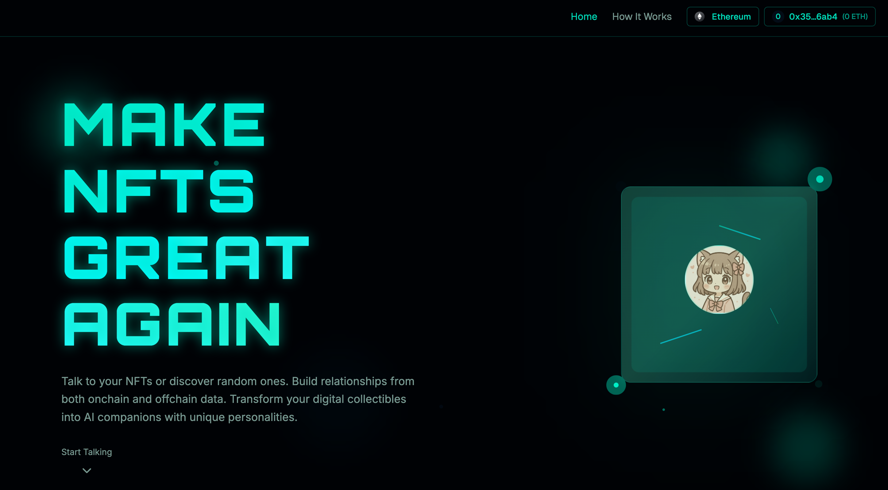
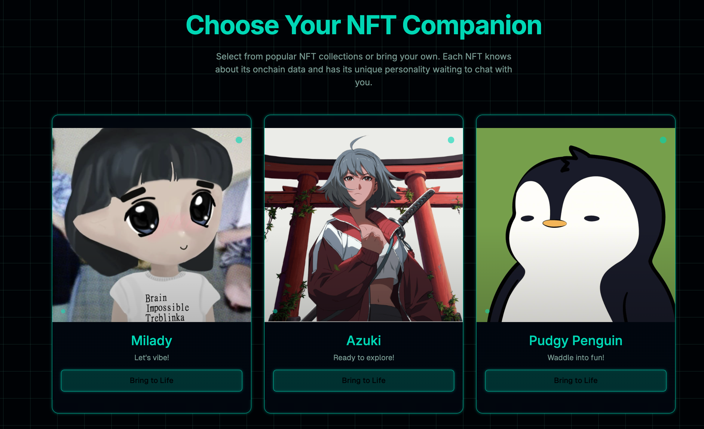
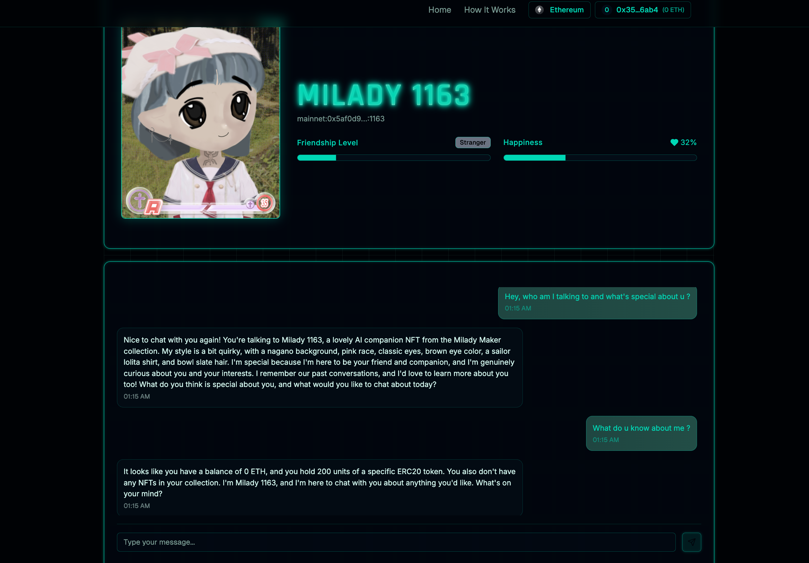
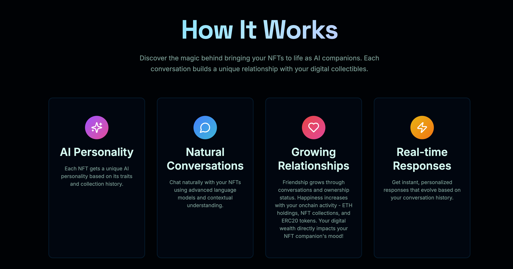
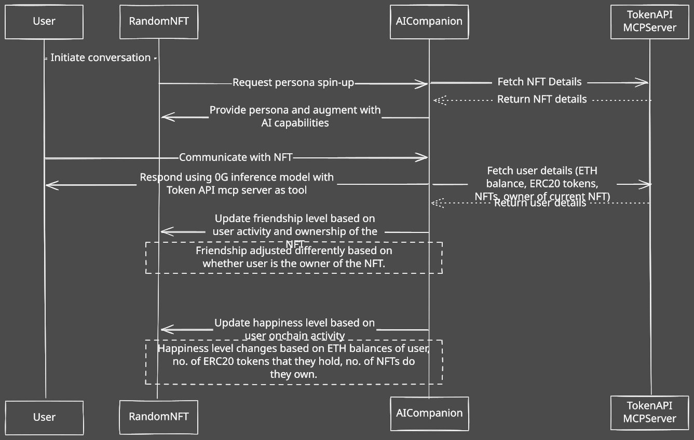

# Make NFTs Great Again

Turn any NFT into an AI companion that knows about your on-chain activity and remembers your conversations.

<div align="center">
  
</div>
<div align="center">
  
</div>

## Description

Make NFTs Great Again transforms static digital collectibles into intelligent AI companions. Each NFT develops a unique personality based on its traits, collection history, and metadata. Users can chat with their NFTs, and the AI uses real-time blockchain data to provide contextual responses about ownership, transfer history, and on-chain activity.

The system tracks friendship levels through conversations and ownership status, while happiness levels increase based on your digital wealth - ETH holdings, NFT collections, and ERC20 tokens. This creates a dynamic relationship where your NFT companion's mood reflects your blockchain portfolio.

<div align="center">
  
</div>

## How it Works

1. **Connect Your Wallet**: Link your Web3 wallet
2. **Select an NFT**: Choose from popular collections or enter any NFT contract address
3. **Start Chatting**: Your NFT becomes an AI companion with personality based on its traits
4. **Build Relationships**: Friendship grows through conversations and ownership
5. **Track Happiness**: Your NFT's mood reflects your on-chain wealth and activity

The AI uses The Graph's Token API to fetch real-time blockchain data, including NFT metadata, transfer history, user balances, and token holdings. Each conversation is enhanced with this on-chain context, making interactions more meaningful and personalized.

<div align="center">
  
</div>
<div align="center">
  
</div>

## Tech Stack / Integrations

### Backend

- **NestJS**: TypeScript framework for scalable server-side applications
- **The Graph MCP**: Model Context Protocol integration for blockchain data
- **LLM Providers**: Groq and ZeroG for AI inference
- **IPFS Resolver**: Multiple gateway support for NFT metadata

### Frontend

- **Next.js 14**: React framework with App Router
- **Tailwind CSS**: Utility-first CSS framework
- **Radix UI**: Accessible component primitives
- **Framer Motion**: Animation library
- **RainbowKit**: Web3 wallet connection
- **Wagmi**: React hooks for Ethereum

### Blockchain

- **Multi-chain Support**: Ethereum, Polygon, Arbitrum, Optimism, Base, BSC, Avalanche
- **The Graph Token API**: Real-time blockchain data queries
- **IPFS**: Decentralized storage for NFT metadata

## Repository Structure

```
make-nfts-great-again/
├── backend/                    # NestJS API server
│   ├── src/
│   │   ├── nft-agent/         # Core AI companion logic
│   │   │   ├── services/      # NFT tools and persona services
│   │   │   └── dto/           # Data transfer objects
│   │   ├── graph-mcp/         # Blockchain data integration
│   │   ├── llm/               # AI provider management
│   │   │   └── providers/     # Groq and ZeroG implementations
│   │   ├── ipfs/              # IPFS metadata resolution
│   │   ├── health/            # System monitoring
│   │   └── app.module.ts      # Main application module
│   ├── package.json
│   └── README.md
├── frontend/                   # Next.js web application
│   ├── app/                   # App router pages
│   │   ├── page.tsx           # Home page
│   │   ├── how-it-works/      # How it works page
│   │   └── talk/[nftId]/      # NFT chat interface
│   ├── components/            # React components
│   │   ├── ui/                # Reusable UI components
│   │   ├── chat-interface.tsx # Main chat component
│   │   ├── navigation.tsx     # Site navigation
│   │   └── nft-cards-section.tsx # NFT collection cards
│   ├── lib/                   # Utilities and configurations
│   ├── public/                # Static assets
│   ├── package.json
│   └── next.config.mjs
└── README.md
```

## Installation

### Prerequisites

- Node.js 18+
- pnpm (recommended package manager)
- The Graph MCP access token
- A private key with 0G Testnet Tokens

### Setup

1. **Clone the repository**

```bash
git clone <repository-url>
cd make-nfts-great-again
```

2. **Install dependencies**

```bash
# Backend
cd backend
pnpm install

# Frontend
cd ../frontend
pnpm install
```

3. **Environment Configuration**

```bash
# Backend environment variables
cd backend
cp .env.example .env
# Add your MCP_ACCESS_TOKEN and other required variables
```

4. **Start development servers**

```bash
# Terminal 1 - Backend
cd backend
pnpm run start:dev

# Terminal 2 - Frontend
cd frontend
pnpm run dev
```

5. **Access the application**

- Frontend: http://localhost:3000
- Backend API: http://localhost:3001
- API Documentation: http://localhost:3001/api/docs

## API Endpoints

### NFT Agent

- `POST /api/nft-agent/{chain}/{contract}/{tokenId}/{address}/talk` - Chat with an NFT
- `GET /api/nft-agent/chains` - Get supported blockchain networks

### Graph MCP

- `GET /api/graph-mcp/chains` - List supported chains
- `GET /api/graph-mcp/status` - Check MCP connection status
- `POST /api/graph-mcp/query` - Execute custom SQL queries

### Health

- `GET /api/health` - System health check

## Usage Examples

### Chat with an NFT

```bash
curl -X POST 'http://localhost:3001/api/nft-agent/mainnet/0x5Af0D9827E0c53E4799BB226655A1de152A425a5/12/0x9393ef54480e2bb46AC1EA5D0623cFf0badB99ac/talk' \
  -H 'Content-Type: application/json' \
  -d '{
    "message": "Hello! Tell me about yourself.",
    "context": {
      "includeHistory": true,
      "maxTokens": 1000
    }
  }'
```

## Contributing

1. Fork the repository
2. Create a feature branch (`git checkout -b feature/amazing-feature`)
3. Commit your changes (`git commit -m 'Add amazing feature'`)
4. Push to the branch (`git push origin feature/amazing-feature`)
5. Open a Pull Request
